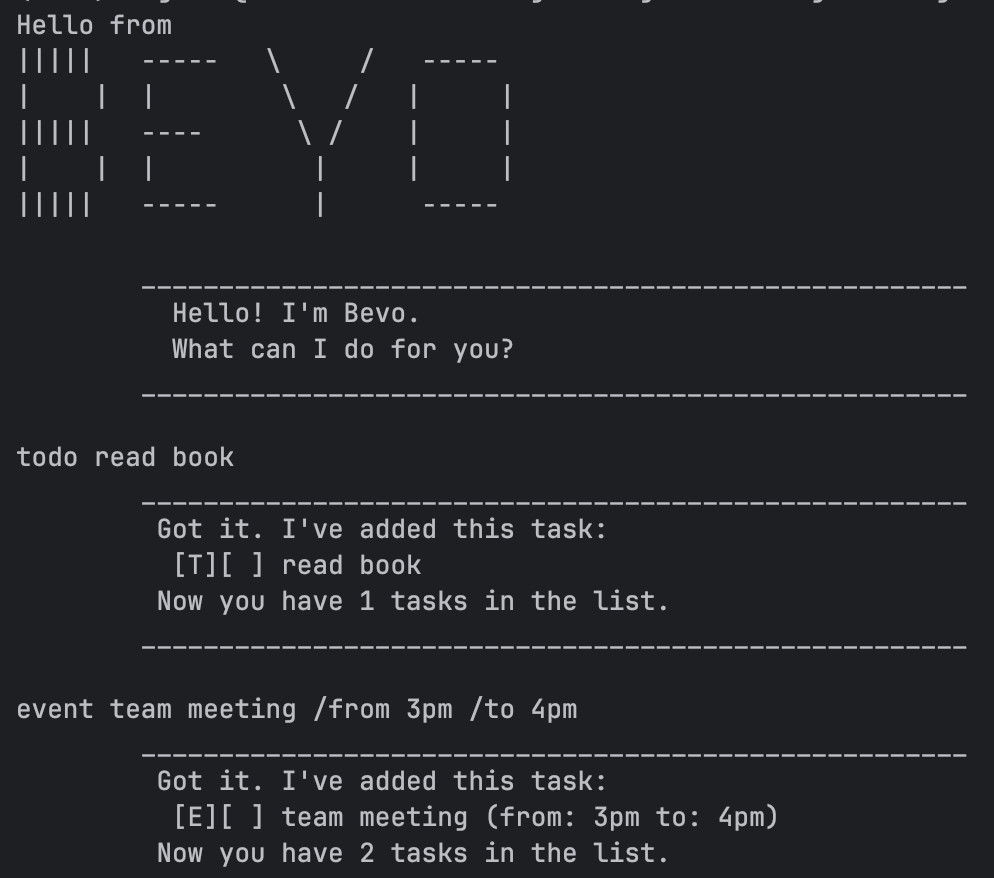

# Bevo User Guide



Bevo is a command-line based task manager to help users
manage their tasks. Bevo lets you add, list, find, mark,
and delete tasks. Bevo automatically loads and saves the
task list from a save file `/data/bevo.txt` at bootup and
closing.

## Adding a todo: `todo`

Adds a task with a description.

General format: `todo DESCRIPTION`

Example: `todo read book`

Expected output:

```
____________________________________________________________
Got it. I've added this task:
  [T][ ] read book
Now you have 1 task in the list.
____________________________________________________________
```

## Adding a event: `event`

Adds a task with a start and end time.

General format: `event DESCRIPTION /from START /to END` 

Example: `event team meeting /from 3pm /to 4pm`

Expected output:

```
____________________________________________________________
Got it. I've added this task:
  [E][ ] team meeting (from: 3pm to: 4pm)
Now you have 2 tasks in the list.
____________________________________________________________
```

## Adding a deadline: `deadline`

Adds a task with a due date.

General format: `deadline DESCRIPTION /by DATE`

Example: `deadline return book /by Jan. 1st`

Expected output:

```
____________________________________________________________
Got it. I've added this task:
  [D][ ] return book (by: Jan. 1st)
Now you have 3 tasks in the list.
____________________________________________________________
```

## Marking a task: `mark`

Marks a specific task as completed.

General format: `mark LOCATION`

Example: `mark 1`

Expected output:

```
____________________________________________________________
Nice! I've marked this task as done:
  [T][X] read book
____________________________________________________________
```

## Unmarking a task: `unmark`

Marks a specific task as uncompleted.

General format: `unmark LOCATION`

Example: `unmark 1`

Expected output:

```
____________________________________________________________
OK, I've marked this task as not done yet:
  [T][ ] read book
____________________________________________________________
```

## Deleting a task: `delete`

Deletes a specific task from the task list.

General format: `delete LOCATION`

Example: `delete 3`

Expected output:

```
____________________________________________________________
Noted. I've removed this task:
  [D][ ] return book (by: Jan. 1st)
Now you have 2 remaining tasks in the list.
____________________________________________________________

```

## Listing all tasks: `list`

Lists all the tasks currently stored in the task list.

General format: `list`

Example: `list`

Expected output:

```
____________________________________________________________
1.[T][ ] read book
2.[E][ ] team meeting (from: 3pm to: 4pm)
____________________________________________________________

```

## Finding specific tasks: `find`

Lists all the tasks whose descriptions contains the
keyword.

General format: `find KEYWORD`

Example: `find book`

Expected output:

```
____________________________________________________________
1.[T][ ] read book
2.[D][ ] return book (by: June 6th)
____________________________________________________________

```

## Exiting Bevo: `bye`

Closes Bevo and ends the program

General format: `bye`

Example: `bye`

Expected output:

```
____________________________________________________________
Bye. Hope to see you again soon!
____________________________________________________________

```